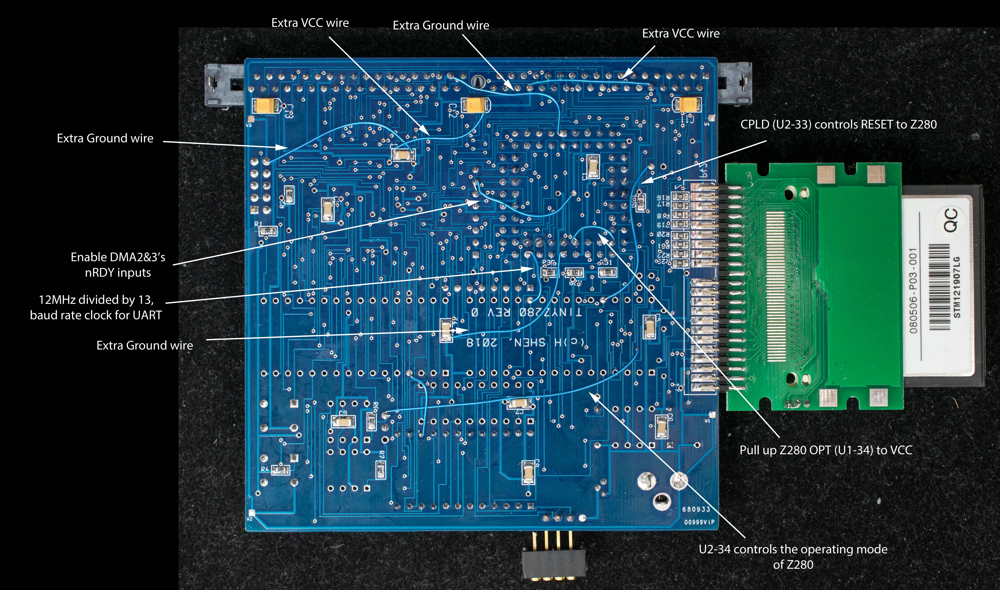

# TinyZ280 Engineering Changes
The TinyZ280 [schematic](tinyz280_scm_annotated.pdf) contains annotated Engineering Changes. However, there are additional changes that are not described in the schematic. All the engineering changes are applied at the solder side of the TinyZ280 PC board. Below is the annotated photograph of the solder side.

Summary of the EC:

- Extra ground wires and VCC wires are added to reduce the system noises.
- 12MHz divided by 13 to generate 923KHz clock to counter1 input (Z280 pin 41). The 923Khz clock is internally divided by 16 to generate 57.7buad serial clock.
- Z280 OPT input (pin 34) is pulled up to VCC
- nRDY2 and nRDY3 inputs (Z280 pin 63 and 58, respectively) are pulled to ground to enable the DMA channel 2 & 3.
- CPLD pin 33 is connect to RESET input of Z280. This way Z280 is held in reset while CF is initialized.
- Mode jumper is connected to CPLD pin 34. The jumper determines whether Z280 bootstrap using UART or CF.
