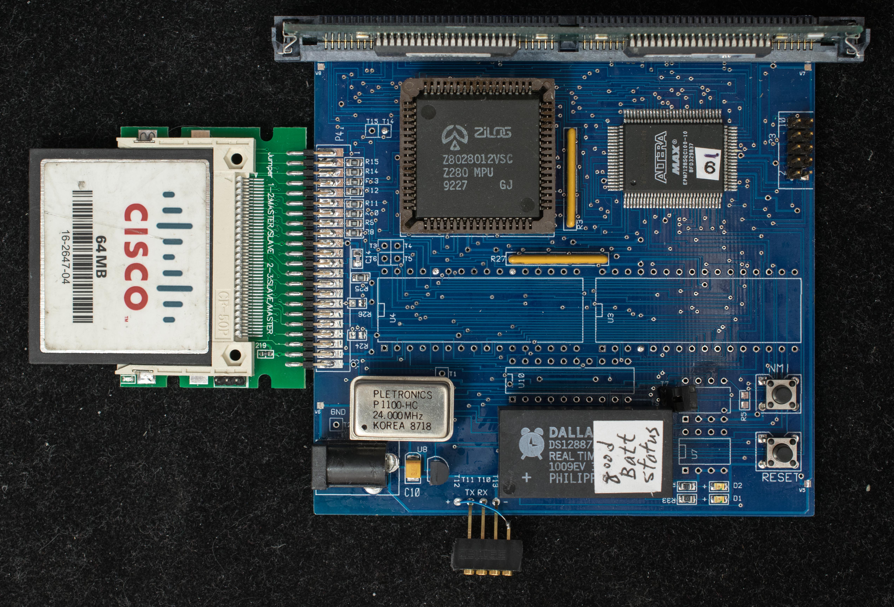
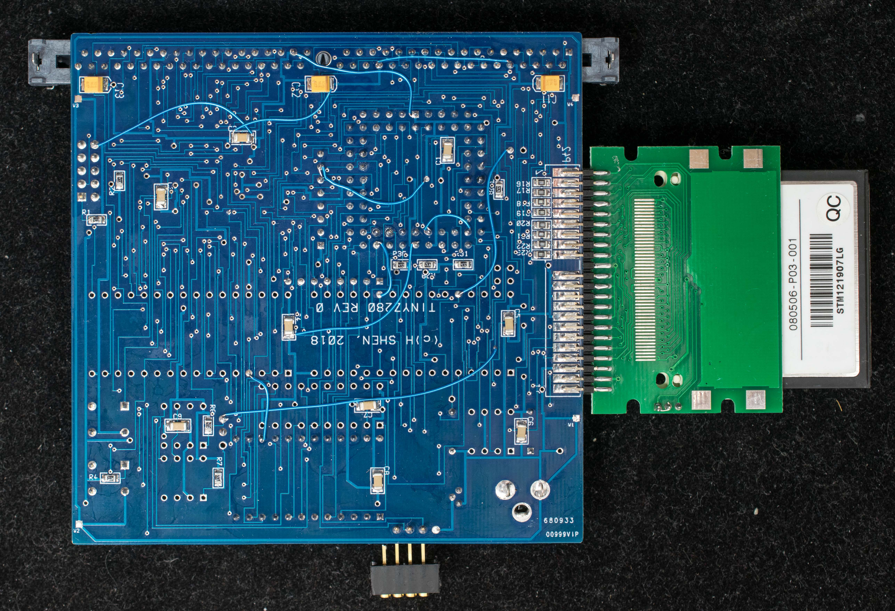
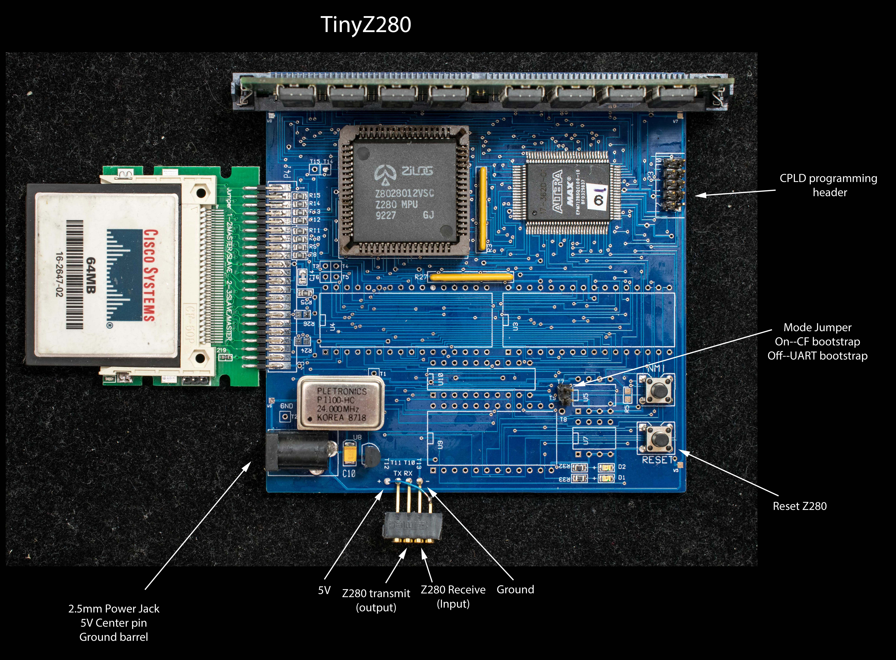

# Final Step, TinyZ280 Putting it all together
The [previous steps of TinyZ280 development](..README.md) are historical document leading to the final implementation of TinyZ280. This document the finished implementation for the TinyZ280.



## Features
- Z280 at full bus speed of 12MHz
- 4 megbyte of DRAM, can be upgraded to 16 megabyte
- RTC based on Dallas DS12887
- Bus connected CF interface
- Four 8-meg CF drives (A: to D:)
- 3.5-meg RAM drive (E:)
- One internal UART at 57600 baud, odd parity, no handshake
- bootstrap from CF disk to ZZMon, a simple monitor
- CP/M 2.2
- CP/M 3 non-banked
## Modes of Operation
TinyZ280 has two modes of operation as determined by the mode jumper at power up (see picture below for location of mode jumper). Jumper removed set the UART bootstrap mode; jumper inserted set the CF bootstrap mode.

### UART Bootstrap
At power up the Z280 CPU is held in idle state until 256 bytes of instruction is uploaded to UART (57600 baud, odd parity, and no handshake) which is then copied to memory starting from location 0x0. Afterward the CPU starts execution from 0x0. In UART bootstrap mode, the program “LoadnGo.run” is send to the UART. LoadnGo contains a 256 bytes binary file that loads the following ZZMon in Intel Hex format and then jump to the starting address of ZZMon. This is the mode to initialize a new CF disk. The cold bootstrap code is written to boot sector and ZZMon itself is written to track 0 of CF in this mode. All the functions of ZZMon is accessible in UART bootstrap mode. In fact the TinyZ280 hardware has all the functionalities except it needs to be booted up serially at power up and every reset.

### CF Bootstrap
This is normal mode of operation. At powerup, the state machine in CPLD initializes the CF to access cold bootstrap code stored in the boot sector and map the memory from 0x0-0x1FF to the data register of CF. Once the boot sector data is loaded into the 512-byte FIFO of CF data register, the state machine releases the reset of Z280 which then executes a two-stage bootstrapping operations:

1. Z280 executes the cold bootstrap code which copies a small CF loading program into memory and then jump into the CF loading program.

2. The CF loading program loads the monitor, ZZMon, from CF disk into memory and jump to ZZMon. ZZMon will display a sign-on message and wait for user inputs. Refer to [ZZMon manual](Manuals/ZZMon_V07.md) for details.

Here is a more detailed description of the [CF bootstrap](CF_bootstrap.md) operation.



## Initialize a New CF disk
The CF disk shipped with the board already has all the necessary software loaded. When a new CF disk is used for the 1st time, the following steps are required:

Insert the new CF disk, remove the mode jumper and power up the board up in UART bootstrap mode. There will be no sign-on message displayed on the console because TinyZ280 is waiting for file upload via the serial port (57600 baud, odd parity, 8 data bits, 1 stop, no handshake). send the program 'LoadnGo.run', you should see a series of dots each denoting a successful load of a Intel Hex record and finished with the sign-on message:
```
TinyZZ Monitor v0.8 3/25/18
>
```
ZZMon is running at this point. Issue the commands:

**c0 (press enter to execute)** to copy the cold bootstrap code to CF's boot sector,

**c1 (press enter to execute)** to copy the ZZMon to CF's LBA sectors 0xF8-0xFF

Power down TinyZ280 and insert the mode jumper and re-apply the power. The ZZMon should sign on with the message:
```
TinyZZ Monitor v0.8 3/25/18
>
```
upload the Intel Hex file cpm22all.hex (the program can be found in the Software section below). Issue the command:

**c2 (press enter to execute)** to copy cpm22 CCP/BDOS/BIOS into LBA sector 0x80-0x92

Upload the Intel Hex file cpmldr.hex (the program can be found in the Software section below). Issue the command:

**c3 (press enter to execute)** to copy CPM3 loader into LBA sector 0x1-0xF

Issue the commands:

**xA (press enter to execute) to erase drive A directory**

**xB (press enter to execute) to erase drive B directory**

**xC (press enter to execute) to erase drive C directory**

**xD (press enter to execute) to erase drive D directory**

upload cpm22dri.hex (the program can be found in the Software section below). This is cpm22 distribution files image that'll be loaded into RAM drive (drive E:). When the upload is completed, issue the command:

**b2 (press enter to execute)** to boot CP/M 2.2. At the CP/M prompt type:

**e:pip b:=e:*.*[v]** to copy cpm22 distribution files from the RAM disk to drive B.

Press the reset button to exit CP/M 2.2 to ZZMon and upload cpm3dstr.hex (this program can be found int the Software section below). This is the CPM3 distribution files image that'll be loaded into RAM drive (drive E:). The upload will take about 5 minutes. When the upload is completed, issue the command:

**b2 (press enter to execute)** to boot CP/M 2.2. At the CP/M prompt type:

**b:pip a:=e:*.*[v]** to copy CPM3 distribution files from the RAM disk to drive A.

Press the reset button to exit CP/M 2.2 to ZZMon and type

**b3 (press enter to execute)** to boot CP/M 3. At the CP/M prompt type:

**pip c:=a:*.*[v]** to make a copy fo CP/M 3 distro to drive C:

This completes the initialization of a new CF disk.

## Design Files
- TinyZ280 [schematic with annotation](tinyz280_scm_annotated.pdf) of engineering changes
- [Gerber photoplots](../tinyz280_r0.zip). The boards were manufactured by Seeed Studio
- [Engineering Changes](Engineering_change.md)
- CPLD design file.
  - CPLD design file for [16 megabyte DRAM](released_16meg_rtc.zip). 16 meg DRAM [POF programming file](tinyz280_16meg_rtc_pof.zip).
  - CPLD design file for [4 megabyte DRAM](tinyz280_4meg_rtc.zip). 4 meg DRAM [POF programming file](tinyz280_4meg_rtc_pof.zip).
### Software
- [ZZMon](Software/zzmon.zip) – monitor for TinyZ280. Assembled with Zilog ZDS v3.68
- [LoadnGo](Software/loadngo_run.zip) – load file to start up ZZMon in UART bootstrap mode
- CP/M2.2, [CPM22ALL](Software/cpm22all_asm_TinyZ280.zip) to be assembled with Zilog ZDS v3.68. This is the entire CP/M2.2 including BDOS, CCP, and BIOS
- CP/M2.2 [Intel Hex load file](Software/cpm22all_hex_loadfile_TinyZ280.zip) to be loaded by ZZMon at location 0xDC00-0xFFFF and then copy to CF track 0 using the 'C2' command
- CP/M3 [LDRBIOS](Software/ldrbios.zip) to be assembled with ZMAC into LDRBIOS.REL and then linked in CP/M as follow: LINK CPMLDR[L100]=CPMLDR, LDRBIOS
- CP/M3 [CBIOS3](Software/cbios3.zip) (non-banked) to be assembled with ZMAC into CBIOS3.REL and then linked in CP/M as follow: LINK BIOS3[OS]=CBIOS3,SCB
- CP/M3 CPMLDR.COM linked to 0x1100. This is an [Intel Hex file](Software/cpmldr_hex.zip) to be loaded by ZZMon at location 0x1100 and copy to CF track 0 using the 'C3' command
- CP/M2.2 DRI distribution image
- CP/M3 distribution image
### Manual
- [Getting Started](Manuals/Getting_started.md) Guide
- [ZZMon operating manual](Manuals/ZZMon_V07.md)
- TinyZ280 [software build procedures](Manuals/Software_build_procedure.md)
- Creating a [new CF disk](Manuals/New_CF_disk.md) for TinyZ280
