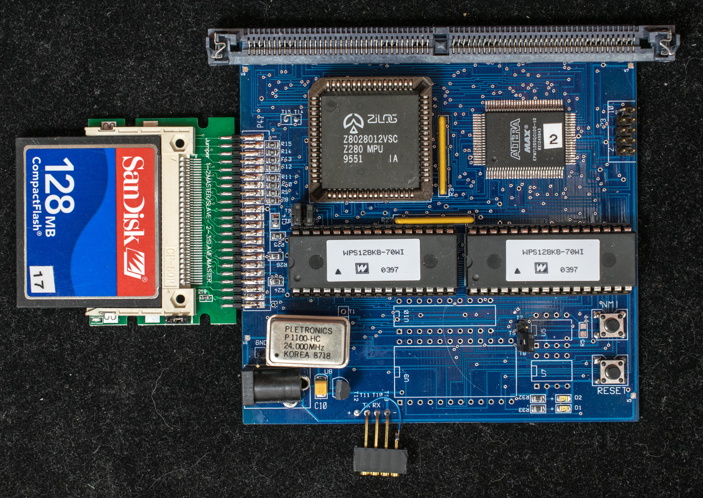
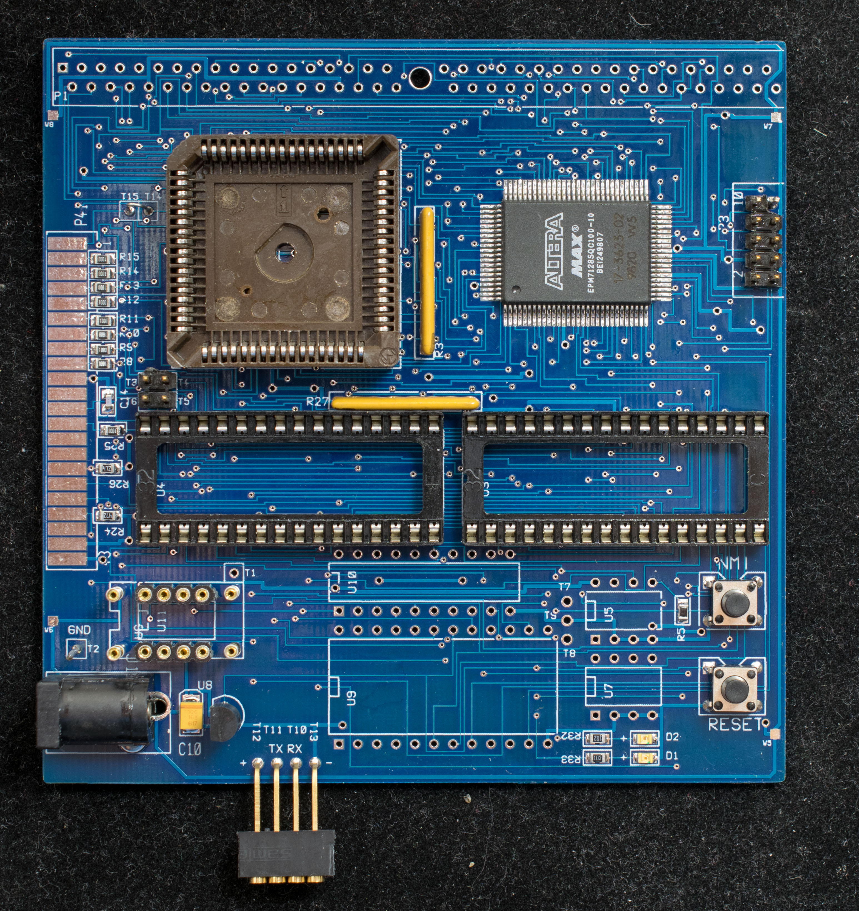
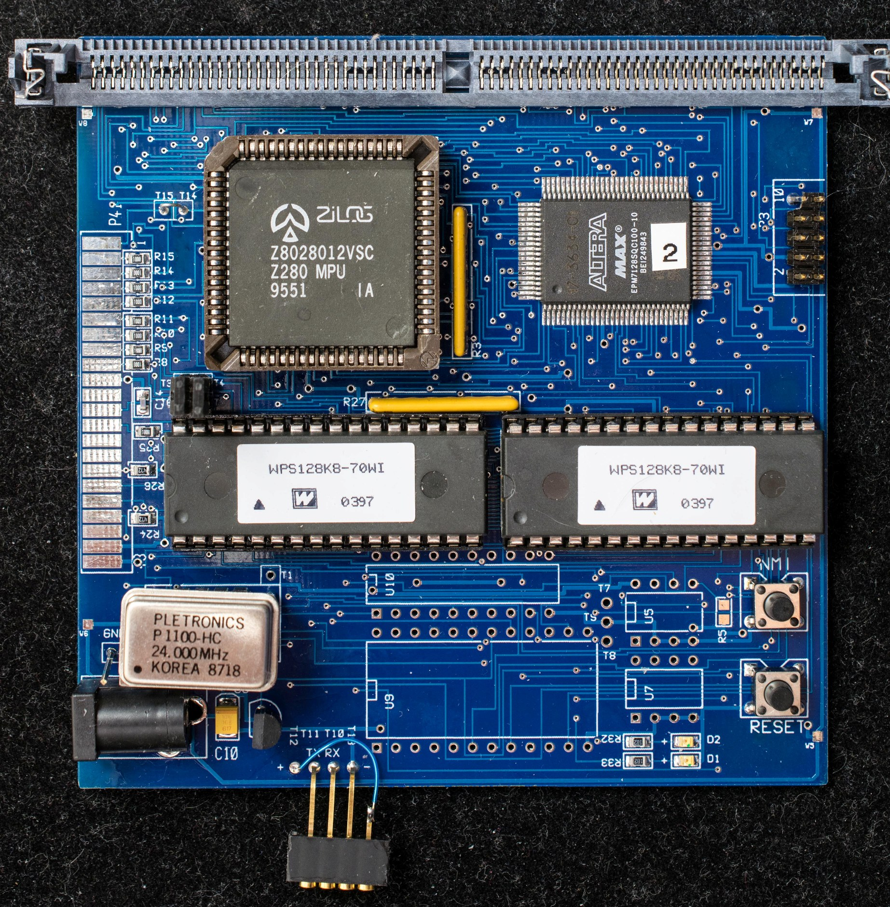

# TinyZ280, Prototyping the Z280 in 100mm X 100mm PC Board (AKA TinyZZ)
## Introduction
I'm new to Z80. I looked at Z280 more closely after a round of interesting discussion with Lamar Owen and really like what I read. The prototype TinyZ280 board is the result of that discussion. It is a pathfinder board; it has multiple ways of booting up and different RAM choices so I can learn and hopefully get smart along the way. Another goal of this prototype is a stepping stone to TinyZZ, a low cost disposable Z280-based computer to experiment with. I don't want to tear down experiments just to salvage and re-use the computer. To keep the cost down and setting up experiment easier, it (TinyZZ) will not have boot ROM or flash. It will boot out of CF. The UART bootstrap feature is used to boot up the first time and configure the CF. CPLD is large enough to have spare pins and logics to support experiments. This prototype board is the vehicle to investigate how feasible the TinyZZ concepts are.


## Design Concept
[Schematic of TinyZ280](tinyz280_scm.pdf). There are 4 different ways to boot up the Z280:

1. UART bootstrap. This method is based on Z280's UART bootstrap feature where nWAIT signal is asserted and the value 0x40 is presented on the data bus AD[7:0] when nRESET signal is negated. This will cause Z280 to enter its UART bootstrap mode where it will configure DMA channel 0 to transfer 256 bytes of data from UART to memory location 0-0xFF. Once 256 bytes of data are received, it will release the reset to Z280 CPU and program execution will start at location 0. The serial baud rate is determined by the clock to counter channel 1 divided by 16. The parity is set to odd. The current serial configuration is 57600, odd parity, 8 data bits, 1 stop. This configuration requires either SIMM DRAM or two 128Kx8 RAM in U3 and U4
2. Flash memory. This is the conventional method of booting up. Jumper block J3-J6 are configured as J3-J4, J5-J6, and two 29F010 flash memory devices are programed with the appropriate software and inserted in U3 and U4. This configuration requires SIMM DRAM populated as the volatile memory.
3. CF flash. The bootstrap code is in track 0, sector 1 of the compact flash drive. After reset, memory locations 0-0xFF are mapped to the 16-bit wide data register of the compact flash drive. After streaming 256 bytes of instructions from the CF, Z280 will have copied enough code to execute a small bootstrap that will bring in rest of the software from CF. This configuration requires either static RAM in U3/U4 or DRAM in the SIMM socket.
4. Serial EEPROM. The serial EEPROM, AT24C256, contains 32K bytes of monitor/debugger software. At power up, the CPLD holds Z280 in reset and copy the content of the serial EEPROM into RAM or DRAM starting from memory location 0. When the copy is completed, the Z280 reset is released and execution starts from location 0. This configuration requires RAM in U3/U4 or DRAM in the SIMM socket.

There are two RAM configurations:
1. Static RAM. U3 and U4 hosts two 128K X 8 static RAM. The jumper block J3-J6 are set as follow: J3-to-J6, J4-to-J5
2. Dynamic RAM. Populate the SIMM socket with up to 16 megabyte of 72-pin SIMM DRAM.
There are still pc board space available after the above requirements are fulfilled. So it is filled with a serial device, COM81C17 and a real-time clock, DS12887.

The key to the design is Altera's EPM7128 CPLD. Different configurations will require a different CPLD design. The first configuration is to boot up using UART bootstrap. Once UART bootstrap is successful and the appropriate software are developed, it will program the CF's track 0 sector 1 with the CF bootstrap code. Then Altera CPLD is reprogrammed with new design to bootstrap out of CF's track 0/sector 1. The volatile memory will be SRAM during the development period because it is easier to debug with static RAM. At the end of the development period the SRAM will be replaced with cheaper DRAM.

## Implementation

[PC board design files](tinyz280_r0.zip) are here. The pc board is 100mm x 100mm, 1.2mm thick. It was manufactured by Seeed Studio.

Construction notes is here.

### Step 1, UART Bootstrap

The picture above shows what need to be populated to support the UART bootstrap configuration. The serial port is set to 57600 baud, odd parity, 8 data bit, 1 stop. The operating guide for UART Bootstrap configuration is here.

This is [Altera EPM7128 design for UART bootstrap](TinyZ280_CPLD_tinyzram.pdf) in PDF schematic. This is the [programming file](tinyzram_program_file.zip).

When reset button is pressed or when initially powered up, the board expects a 256-byte serial binary data stream. After 256 bytes of data is received, Z280 will start program execution at location 0. TinyLoad is the 256-byte boot program; it has three functions:

1. It clears memory from 0x100 to 0xFFFF to zero.
2. It expects Intel hex file and save it to memory specified by the load address. It will check every record and print a period (.) if the checksum matches or question mark (?) if the checksum does not match. It will output 'U' for unrecognized record format and 'X' for end of record.
3. It recognizes the 'G' command and transfers the control to the 4-byte address follow the 'G' command. Please note: the 4-byte address is not echo back on the terminal, only the 'G' followed by a blank is displayed.
4. 
When TinyLoad is successfully loaded and executing, it will display the following message:
```
TinyLoad 1
G xxxx when done
```
This is [TinyLoad binary](tinyload_binary.zip). This is [TinyLoad source](tinyload_asm.zip).

Glitchmon is a small monitor that display/modify memory, display/modify I/O port, and jump to specified address. It is derived from Glitchwork: https://github.com/chapmajs/glitchworks_monitor

This is [Glitchmon hex load](glitchmon_hex_loadfile.zip). This is [Glitchmon source](glitchmonhcs_asm.zip).

cpm22all is CP/M ver 2.2 source in Z80 mnemonics. The CCP and BDOS are downloaded from cpm.z80.de: http://cpm.z80.de/download/cpm2-asm.zip

This is [cpm22all hex load file](cpm22all_hex_loadfile.zip) in Intel Hex format. This is [cpm22all assembly source](cpm22all_asm.zip).

Step 2, CF Bootstrap
(2/11/18) CF Bootstrap is working. The pc board is modified to add a jumper that switch between UART bootstrap and CF bootstrap. The reset connection (T14 & T15) is cut and a new output signal from CPLD is now control the reset of the Z280. This is all the physical modifications required. There are significant more firmware and software changes:

New CPLD with CF bootstrap state machine (CFinit) and modified memory map. Here is theschematic and the programming file. The state machine design is rather convoluted. Here is the theory of operation.

CF Bootstrap software is evolving. The current approach is a small (~128 byte) cold bootstrap code located in boot sector of a CF. Before Z280 reset is released, the CFinit state machine configured the CF to stream cold bootstrap code out to CF's 16-bit data port. After reset Z280 will execute the code stream which copy a small boot loader into 0x1000 and jump to it which, in turn, load data from sector 2 and 3 and execute. Here is thecold bootstrap code. Here is the utility program to copy cold bootstrap into boot sector. Another utility program to copy software into sector 2 & 3 of CF. The two utility programs will be combined later.

Step 3, CF Bootstrap with DRAM
Blah, blah, blah

Final Step, Putting it all together
After the various steps of incremental development, this is the end product.
